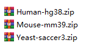
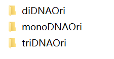
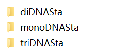

# Description of the **files** directory structure

## files directory

There are five folders, which are assembly, tracks, values, downloads and screenshot.

### assembly directory

There are 3 folders, which are hg38, mm39 and saccer3. We downloaded genome sequence data by chromosome from [UCSC](http://hgdownload.soe.ucsc.edu/downloads.html) and transformed the files into bgzip-compressed indexed FASTA (e.g. .fa.gz, .fa.gz.fai and .fa.gz.gzi files) using [samtools](https://www.htslib.org/).

***
### tracks directory

There are 3 folders (i.e. hg38, mm39 and saccer3), which includes 2 subfolders (i.e. ori and sta). There are .bw files for BigWig tracks in these subfolders.

***
### values directory

There are 3 folders (i.e. hg38, mm39 and saccer3), which includes 2 subfolders (i.e. original and standard). There are binary compressed files used to generate data file for [circos](http://circos.ca/) in these subfolders.

***
### downloads directory

There are 3 compressed assembly files for users to download. You can download these files from iVisGenome(https://ivisgene.pufengdu.org/download).

***

### screenshot directory

The directory stores some screenshots of the directory structure.

Every original (or ori) folder includes 3 subfolders, the directory structure is shown in the image bellow.

Every standard (or sta) folder includes 3 subfolders, the directory structure is shown in the image bellow.

***